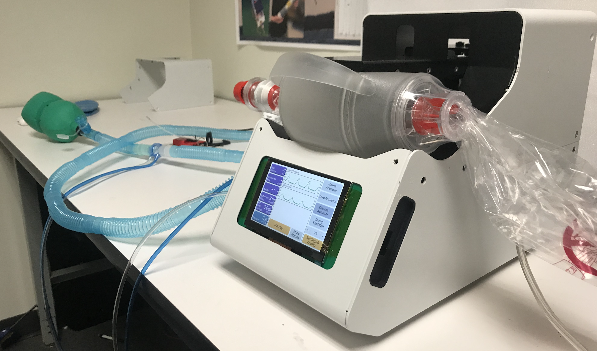
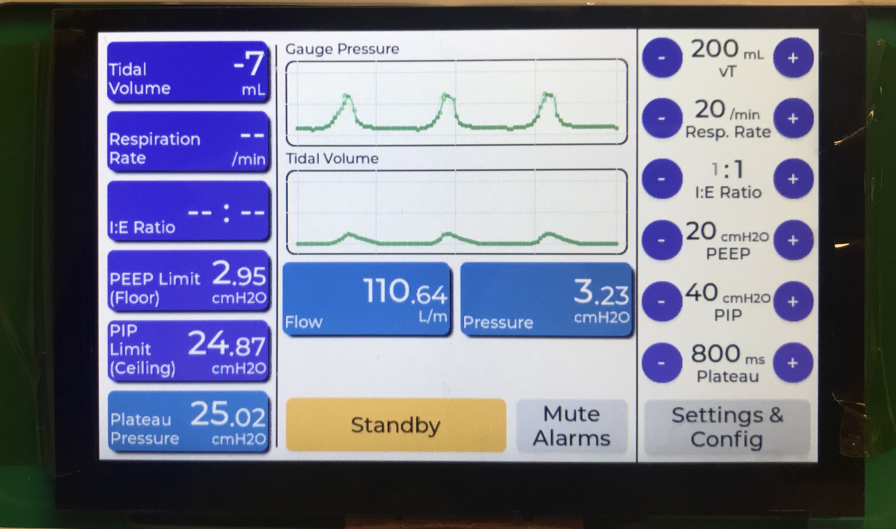

# Universal Ventilator

This repository holds code and documentation related to the Universal Ventilator project. This was developed in collaboration with Worcester Polytechnic Institute, Boston Engineering Corporation with support from the Massachusetts Technology Collaborative Grant.

The `source` folder contains source code and `docs` folder contains documentation related to the project.

