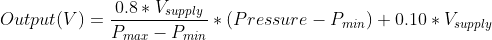
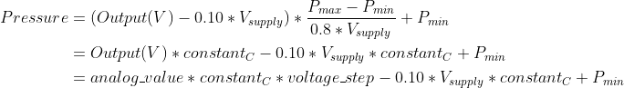
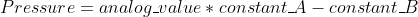
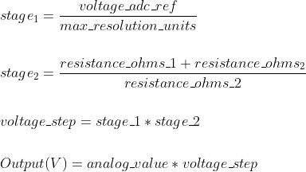
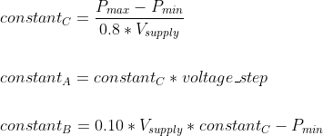

# Introduction
The folder contains code for the Universal Ventilator project.

# Setup
The hardware used in this project uses an Arduino Due. Although the Arduino IDE can be used, this project has been developed using VSCode and Platform IO as an extension.

Both of the above are open source. Using Platform IO with VSCode offers alot of flexibility, and also extensions for development and debugging.

## Hardware Setup
If using the Arduino board to debug and upload, attach a micro-USB cable to the `Programming USB Port`, which is next to the barrel jack connector.

## Environment Setup

### Install VSCode
Install the latest VSCode for your architecture from [code.visualstudio.com](https://code.visualstudio.com/download)

### Install Platform IO IDE
Open VSCode and browse to the extensions tab(on the right side). Search for Platform IO and install it.

### Platform IO Setup
If the Platform IO project cannot build, it is probably due to `task.autodetect` being turned off.

`CTRL+SHIFT+P` and search for User Settings. Add the following to the settings.json file

```
{
    "task.autoDetect": “on”
}
```

## Workspace Setup

### Opening the Workspace
Open VSCode, File->Open Workspace

### Choose a PlatformIO Environment
In order to build and upload, one of the PlatformIO build environments must be selected.\
In the VSCode toolbar, the environment may be labelled as `Default (Universal Ventilator)`.\
To avoid confusion it is recommended to change your env from default.

#### due-common
The default option, uses the `Programming Port` to upload to the Arduino.
#### due-jlink
Select this if using a JLink device. Provides faster upload through the JTag port, as well as PlatformIO debugging features

### Serial Monitor
Click the plug icon in the bottom toolbar to open a serial monitor window.

### Building the Project

Click the checkmark(✓) on the bottom toolbar to start a build

### Uploading the Project

Select the right arrow(→) to upload code to the Arduino.

### Pressure Sensor Equations

- Equation taken from data
  sheet https://sensing.honeywell.com/honeywell-sensing-trustability-ssc-series-standard-accuracy-board-mount-pressure-sensors-50099533-a-en.pdf

##### Output

> 

##### Solve for Pressure, multiply through and sub in constants:

> 

##### Final equation used to get the pressure:

> 

##### Voltage Step Equations:

> 

##### Constants:

> 

The images for the equations were created with https://www.codecogs.com/latex/eqneditor.php.